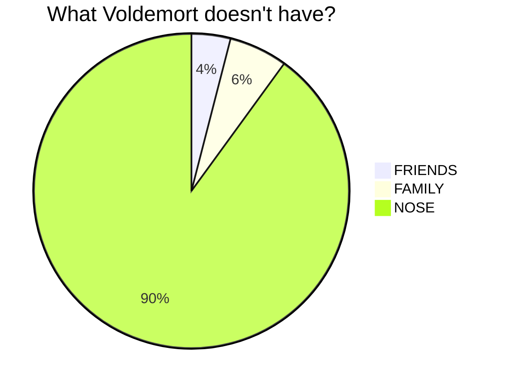

<!-- 
This file is a duplicate of the contributing.mdx in docs/contribute. 

Both files contain the same content: the docs/config file is there to render the content on the website, 
while this copy is needed to make it highlighted in the repository dashboard.

⚠️ If you make updates here, make sure to update the docs/contribute/contributing.mdx as well, and vice versa, 
so both stay in sync.
-->

# **Contributing guidelines**

The Security Frameworks is an open and collaborative initiative. Whether you are part of the Security Alliance or not, we welcome your contributions! Help us build the documentation and improve security in the blockchain ecosystem.

This handbook is designed for easy collaboration and automatic deployment through continuous integration. If you'd like to join our effort, feel free to fix typos, contribute new sections, or propose enhancements.

**Before contributing, please read our [Code of Conduct](https://github.com/security-alliance/frameworks/blob/develop/CODE_OF_CONDUCT.md)** to ensure that all interactions remain respectful, inclusive, and constructive.

Join our [Discord](https://discord.gg/securityalliance) server, let others know what you are working on in the ‘frameworks-reviewers’ group channel, and collaborate with other contributors writing about related topics.

## Live versions

The source code for the Security Frameworks is hosted on GitHub: [github.com/security-alliance/frameworks](https://github.com/security-alliance/frameworks).

- The **main branch** powers the stable Frameworks website (https://frameworks.securityalliance.org/) with reviewed and finalized content.
- The **development branch** (https://frameworks.securityalliance.dev/) contains ongoing updates, new sections, and draft content.

When contributing, **please submit your Pull Requests to the development branch**. Once changes are reviewed and approved, they will be merged into the **main branch** for publication on the stable site.

## Ways to contribute

There are several ways to contribute, depending on your preference and the scope of your changes. First, check existing PRs or branches to make sure your work has not been previously ****submitted**.**

### 1. Quick edits

- Use the **“Contribute today!”** button at the bottom of any page
- Make fixes, formatting, and clarifications, favoring major modifications over just a few grammar mistakes
- Changes go through GitHub’s web interface without requiring local setup

### 2. Add a new section or expand an existing one

All contributions should follow this workflow:

1. **Fork the repository** to your own GitHub account.
2. **Follow the `template.mdx` page** when creating or expanding content. It contains pre-defined components and structure required for consistency in MDX files.
3. **Make your changes** in MDX (typos, improvements, or new content) on your fork.
4. **Open a Pull Request (PR) against the `develop` branch** of this repository. Once submitted, you can see the deployment through Vercel’s automation and make any final adjustments.
5. **Notify reviewers** by tagging a steward or maintainer, requesting reviews directly in your PR.
6. Additionally, you can paste your PR and/or potential associated issues to the `framework-reviewers` Discord channel.
7. Once reviewed and approved, your changes will be merged into `develop`.
8. Don't forget to add yourself to the YAML header of the file you're modifying, given that is the way we provide attribution. You should also create your profile inside the contributors list, at `docs/config/contributors.json`.
9. Periodically, reviewed content from `develop` is merged into `main` for the stable site.

If you’re interested in a framework that doesn’t currently have an active steward, you can **become one yourself**. See the [Stewards guide](/docs/pages/contribute/stewards.mdx) for details on responsibilities and how to get started.

**⚠️ Please sign and verify all commits.** (If you have unsigned commits, follow the “Fixing Unsigned Commits” section below to update them)

## Development environment setup

Choose the development approach that works best for you:

### Option A: DevContainer with VSCode

The easiest way to get started is using our pre-configured devcontainer with VSCode:

1. **Prerequisites**: VSCode with [Dev Containers extension](https://marketplace.visualstudio.com/items?itemName=ms-vscode-remote.remote-containers)
2. **Open the project**: VSCode will detect the devcontainer configuration
3. **Reopen in container**: Command Palette (Ctrl+Shift+P) → "Dev Containers: Reopen in Container"
4. **Start developing**: All tools are pre-installed and ready to use

### Option B: DevContainer CLI Only (No VSCode Required)
Since you won't require extensions for the initiative to work, you can just create a devcontainer using the CLI and access it through whatever mean you think suits you best.

**Using DevContainer CLI (Recommended):**

- Install [DevContainer CLI](https://github.com/devcontainers/cli)

```bash
git clone <https://github.com/security-alliance/frameworks.git>
cd frameworks && git checkout develop
devcontainer up --workspace-folder .
devcontainer exec --workspace-folder . bash
# Get the IP address of the container, by running `hostname -I | awk '{print $1}'`. Should be printed automatically in the terminal after the creation as well
# Inside container: npx just serve
# Access the docs at http://<IP>:5173

```

### Option C: Local installation

If you prefer to install dependencies locally on your machine:

**Prerequisites:**

- Node.js (v18 or later) and npm (for running Vocs locally)
- [markdownlint-cli2](https://github.com/DavidAnson/markdownlint-cli2) (For linting markdown files)
- [GNU Aspell](https://sourceforge.net/projects/aspell/) (For spell checking) - Note: For macOS you can use [Homebrew](https://brew.sh/) to install aspell. Just run `brew install aspell`.
- [Docker](https://docs.docker.com/get-docker/) (Optional: For running the devcontainer)
- [GitHub CLI](https://cli.github.com/) (Optional: For using `gh` to interact with GitHub)

**Setup:**

1. Install all prerequisites listed above
2. Clone the repository:
    
    ```bash
    git clone <https://github.com/security-alliance/frameworks.git>
    cd frameworks && git checkout develop
    ```
    
3. **Install Node.js dependencies:**

    ```bash
    npm install
    ```

4. Start the local development server

    ```bash
    npx just serve
    ```
5. Once the server is running, access the site at port ```5173```

**(Optional) Authenticate with GitHub CLI**: The GitHub CLI (`gh`) is already preinstalled in the devcontainer. You can authenticate by running `gh auth login` in the terminal, making it easy to interact with GitHub directly from your development environment.

# Fixing unsigned commits

If you accidentally made unsigned commits in your fork, you’ll need to rewrite them so they show as **Verified** before opening a PR.

## 1. Rebase your recent commits

- Understand how many commits you have to fix
- Run this command, replacing `N` with the number of commits to go back (starting from the latest one):

```bash
git rebase -i HEAD~N
```

## 2. Mark commits to fix

In the editor that opens:

- Change `pick` → `edit` for each unsigned commit.
- Save and exit.

## 3. Re-sign each commit

For each commit you’re editing:

```bash
git commit --amend -S --no-edit
git rebase --continue
```

Repeat until all commits are re-signed.

## 4. Push your changes

Since history was rewritten, you need to **force-push**:

```bash
git push --force
```

## 5. Verify

Check locally:

```bash
git log --show-signature
```

Or look at your branch on GitHub — commits should show a green **Verified** badge.

## Contributor tasks beyond content changes

When contributing to the Security Frameworks, there are several additional responsibilities to ensure your updates integrate smoothly into the site and maintain proper structure:

### 1. Page tags

- Assign appropriate tags at the top of your pages in the frontmatter to help categorize content by role, topic, or skill level:

```yaml
---
tags:
  - Engineer/Developer
  - Security Specialist
---

```

- Proper tagging makes your contribution discoverable and filterable on the site.

### 2. Contributors metadata

- Add yourself and other relevant contributors to the page frontmatter:

```yaml
---
contributors:
  - role: wrote
    users: [your-github-username]
  - role: reviewed
    users: [reviewer1, reviewer2]
---

```

- Contributors are **managed centrally**:
    1. **Contributor database:** `docs/pages/config/contributors.json`
    2. **Usage guide:** `docs/pages/config/using-contributors.mdx`
- This helps track contributions and ensures proper attribution for edits and reviews.

### 3. Sidebar / Navigation

Because of how we handle the `.org` and `.dev` domains in different branches, when contributing **new pages** you must also **update `vocs.config.ts`** so that the page appears in the site’s sidebar. For content still in review, remember to set `dev: true`.

Example of a category with multiple pages:

```tsx
{
  text: 'Monitoring', // Category name visible in the sidebar
  collapsed: false,
  dev: true, // Indicates this category is in development
  items: [
    { text: 'Overview', link: '/monitoring/README', dev: true }, // Indicates this page is in development
    { text: 'Guidelines', link: '/monitoring/guidelines', dev: true },
    { text: 'Thresholds', link: '/monitoring/thresholds', dev: true },
  ]
},

```

This ensures that new content appears correctly in the site’s navigation for readers on the `.dev` site while staying hidden from the stable `.org` site until ready.

### 4. Error Checking

Before pushing changes, always make sure your build works without errors:

- Run `npx just build` or `npm run docs:build`
- Preview the updated content locally at port `4173` with: `npx just preview` or `npm run docs:preview`

This helps catch build or formatting issues early so reviewers see clean contributions.

## Style guide

Wiki pages follow standard MDX.

The audience of this wiki is technical, and the content should reflect that. There are many guides on technical and documentation writing you can learn from, for example, you can check [this lecture](https://www.youtube.com/watch?v=vtIzMaLkCaM) to get started.

### Writing guidelines

- Write in an objective, explanatory tone; avoid unnecessary simplifications.
- Use concise sentences and break down complex ideas with bullet points, tables, images, or block-quotes.
- Always link your resources and verify them
- Introduce acronyms and technical jargon before using them.
- Web3 changes fast, write the content to be as future-proof as possible
- Do **not** submit content entirely generated by AI; however, we recommend using it to fix grammar or phrasing
- Consider tutorials or hands-on guides for practical steps.
- Use visualizations (mermaid, diagrams, tables) to clarify concepts.
- Add recommended reading or dependencies at the top of a page if relevant.
- Focus on delivering credible, formal, technical content without unnecessary high-level introductions; use examples, comparisons, or anecdotes to clarify complex topics.
- You can use mermaid diagrams for visualizations

### Content standardization

- Use **American English** consistently.
- Follow consistent terminology, capitalization, and nomenclature (see [Ethereum.org style guide](https://ethereum.org/contributing/style-guide/content-standardization)).
- Usage of images and visualizations is encouraged. If you are using an image created by a third party, make sure its license allows it and provide a link to the original. For creating your own visualizations, we suggest [excalidraw.com](https://github.com/excalidraw/excalidraw).
- Feel free to use [emojis](https://docsify.js.org/#/emoji?id=emoji) or [icons](https://icongr.am/fontawesome) where it fits, for example in block-quotes.

### Visual representation / drawings
Like GitHub, we also support Mermaid!

You can use codeblocks using the `mermaid` keyword, and you can create beautiful graphical representations.
There's a [playground](https://www.mermaidchart.com/play#pako:eNqrVkrOT0lVslIqyExVKMksyUlVCM9ILFEIy89JSc3NLypRSMlPLc5TL1HISCxLtY_JU4CBGCW3IE9XP5fgGCUFKwUjVBlHX0-fSLCEMYqEn3-wK1jYxDQmT6kWAEyMIfc) where you can jump straight to draw!



### Linking resources

- Prefer descriptive names for external links (e.g., `inevitableeth.com` instead of “this wiki”).
- Avoid overwhelming readers with too many inline links; consider a **Resources** section at the bottom.
- Use relative paths for internal links and heading IDs for specific sections.
- Provide archived mirrors or snapshots for important external references.

### In-page notices

- Use block-quote notices at the top of pages for context.
- **Incomplete pages** should include a stub notice:

> ⚠️ This article is still in progress. Help the framework by contributing and expanding it.
> 

Pages with minimal content which need more work to cover the topic need to include a notice:

> ⚠️ This article is a [stub](https://en.wikipedia.org/wiki/Wikipedia:Stub), help the framework by [contributing](/docs/pages/contribute/contributing.mdx) and expanding it.

## Anything else?

This page is also open for contributions! Suggest improvements to our style and guidelines in the github repo.

## About this page

Originally inspired by the [Ethereum Protocol Fellows](https://github.com/eth-protocol-fellows/protocol-studies)
