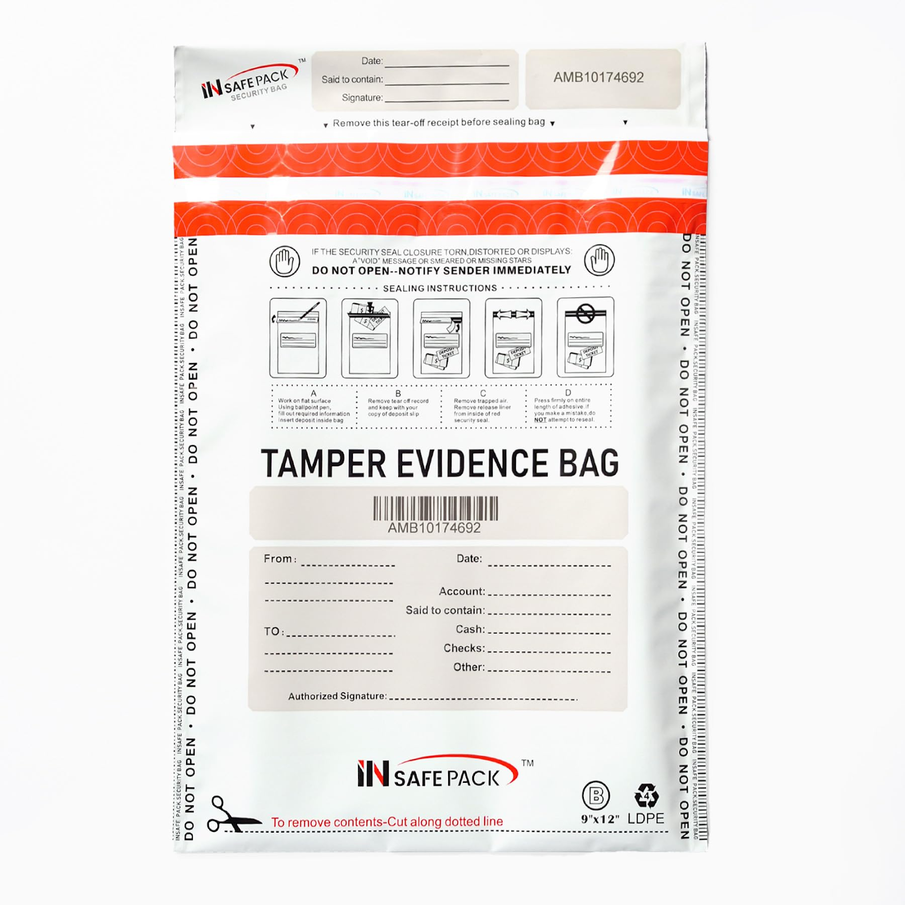

---
tags:
  - Engineer/Developer
  - Security Specialist
  - Multisig Security
contributors:
  - role: wrote
    users: [isaac, geoffrey, louis, pablo]
  - role: reviewed
    users: [dickson]
---

import { TagList, AttributionList, TagProvider, TagFilter, ContributeFooter } from '../../../components'

<TagProvider>
<TagFilter />

# Seed Phrase Security

<TagList tags={frontmatter.tags} />
<AttributionList contributors={frontmatter.contributors} />

## Storage requirements

### Physical storage only:
- Never store digitally - No photos, files, or cloud storage
- Durable offline media - Metal plates or secure paper
- Secure location - Safe deposit box, home safe, or equivalent
- Access control - Limit to trusted family/associates only

## Enhanced security option

For extra security, split seed into 3 pieces:
- **Piece 1**: Words 1-16
- **Piece 2**: Words 9-24
- **Piece 3**: Words 1-8 and 17-24

### Storage locations:
- Different secure locations (safe deposit box, home safe, trusted family)
- Each piece stored with clear labeling system

### Tamper evident bags:

Storing sensitive devices or documents in a tamper evident bag offers high confidentiality and integrity. You can sign & date these bags, and also take a picture of its serial number.

**Use case:**
You can put your Piece 1: Words 1-16 of your seed, inside a safe.
Piece 2: Words 9-24 of your seed, somewhere safe (different location) in a tamper evident bag (could be at your parents place).
Piece 3: Words 1-8 and 17-24 of your seed, somewhere safe (different location) in a tamper evident bag (could be somewhere else, at a family member or trusted friend).
You can put your backup ledger while traveling inside this, in the safe of your hotel room to detect tampering.
The main idea is to never have at the same place your 24 words, but still be able to recover your seed within 2 pieces of paper out of 3.
You can find a useful link here to our EthCC swag that shows you how to easily split your seed in 3 as recommended.

## Prohibited practices

Never do these:
❌ Password managers or digital storage
❌ Cloud storage, email, or messaging apps
❌ Photography or screenshots
❌ Sharing via any digital communication
❌ Traveling with seed phrases
❌ Storing all pieces in same location

## Emergency access plan

### Trusted contacts
- Designate 2-3 trusted individuals who can access backup locations
- Clear instructions for emergency seed access
- Regular check-ins with trusted contacts

### Recovery scenario example
"Call [trusted person] with code word [predetermined phrase], tell them to get the metal plate from safe location A, they give you words 1-16 over the phone. Then call [second person] with code word for location B to get words 9-24. Use both pieces to reconstruct seed immediately, then change all security settings."

### Documentation
- Emergency contact information stored separately from seed
- Code words/phrases for identity verification
- Access instructions for trusted contacts
- Regular testing of emergency procedures
- Update procedures when contacts or locations change

Remember: Your seed phrase security is the foundation of multisig security. Take time to implement proper storage procedures appropriate for your risk level.

</TagProvider>
<ContributeFooter />