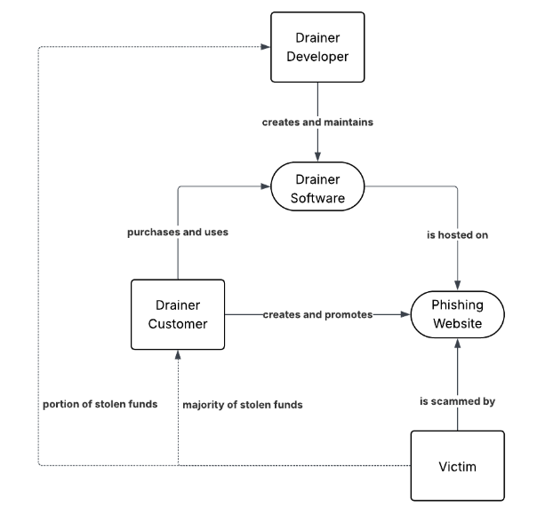

---
tags:
  - Security
  - Wallet Drainers
contributors:
  - role: wrote
    users: [SEAL]
  
---

# Wallet Drainer Advisory

If you’ve been sent this document, then we believe that your funds have been stolen by a wallet drainer. This document will give you some information about drainers, how they work, and how you can protect yourself going forward.

In general, when we refer to a drainer, we’re referring to one of a small number of popular drainer software available. A drainer customer (or “affiliate”) will purchase access to the drainer software from the drainer developer. From there, the affiliate will upload it to phishing websites and promote it via social media, such as Twitter. You can think of drainers like how a franchised restaurant owner will buy the rights to use the logo from the corporation and then pay royalties for every sale.

---

## How Drainers Work

Drainers use a variety of different tactics to gain control over your wallet and tokens. For example, drainers have been known to:

- Request approval to spend your tokens directly  
- Request signatures to buy your tokens via a DEX that you’ve already approved  
- Request permission to upgrade your wallet to a **7702 wallet**, which gives them full control  
- Request your private key or seed phrase directly, which gives them full control  

---

## Recovery

Depending on which type of drainer you were impacted on, you might need to take different actions to recover control of your wallet.
