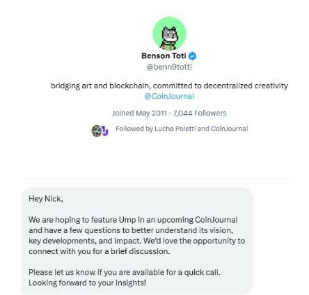
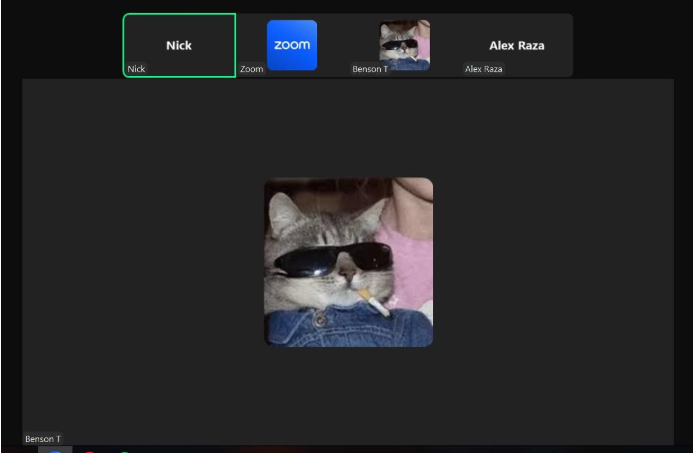
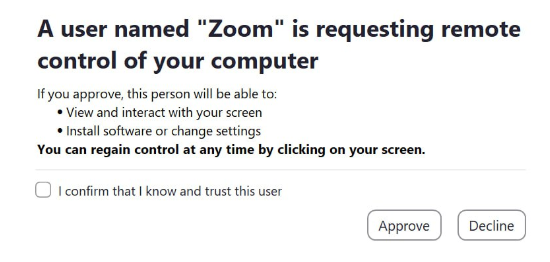
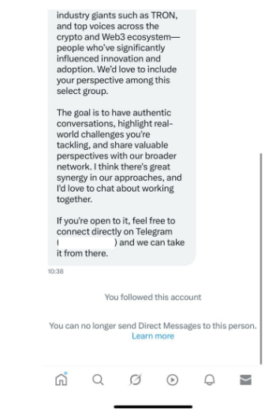

---
tags:
  - Security
  - Threat Actors
contributors:
  - role: wrote
    users: [SEAL]
  
---

# You've Been Hacked by ELUSIVE COMET

If you’ve been sent this, then we believe that you’ve been hacked by a threat actor we’ve identified as ELUSIVE COMET. This document will give you some information about drainers, how they work, and how you can protect yourself going forward.

ELUSIVE COMET is a threat actor which specializes in impersonation and social engineering. Their primary mode of operation is to impersonate a well-known individual (such as a journalist, a podcast host, an investor, etc) in order to convince the victim into getting onto a Zoom call.

---

> ELUSIVE COMET account reaching out to a potential victim

Once on the Zoom call, ELUSIVE COMET applies pressure and time urgency to convince victims to share their entire screen. If victims join from a browser or a phone, they may claim that they can’t hear or see the victim. If victims only share a specific window, they may claim that they can’t see the window, and that the entire screen needs to be shared.

---

> ELUSIVE COMET hackers on the Zoom call. Note the presence of a user named “Zoom”

ELUSIVE COMET requires that victims share their entire screen because Zoom contains a feature which allows users to request remote control access, but only if the target is sharing their entire screen. When the victim shares their screen, ELUSIVE COMET requests control from the “Zoom” user, which results in this prompt.

---

> Prompt shown by Zoom when ELUSIVE COMET requests remote control

Once the victim approves this request, ELUSIVE COMET uses the remote control to install malware to the victim’s computer. At this point, they are able to steal private keys, sensitive files, login sessions, and other valuable information. They use this to steal crypto, but also to perpetuate their scam by hijacking the victim’s social media accounts and sending out phishing messages to more people.

---

> A message sent from an account belonging to a victim of ELUSIVE COMET
