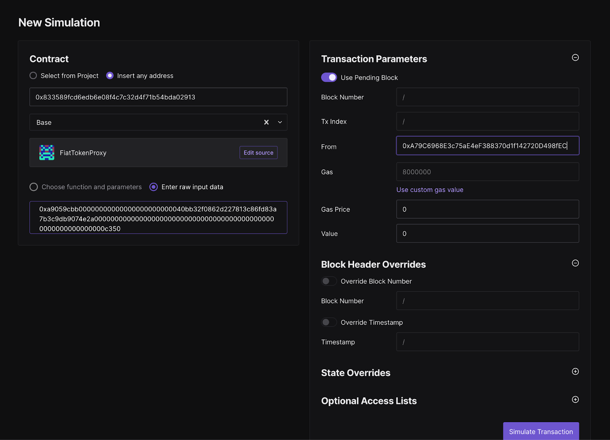
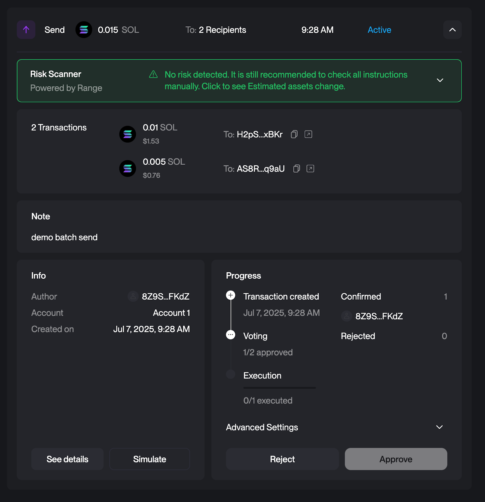
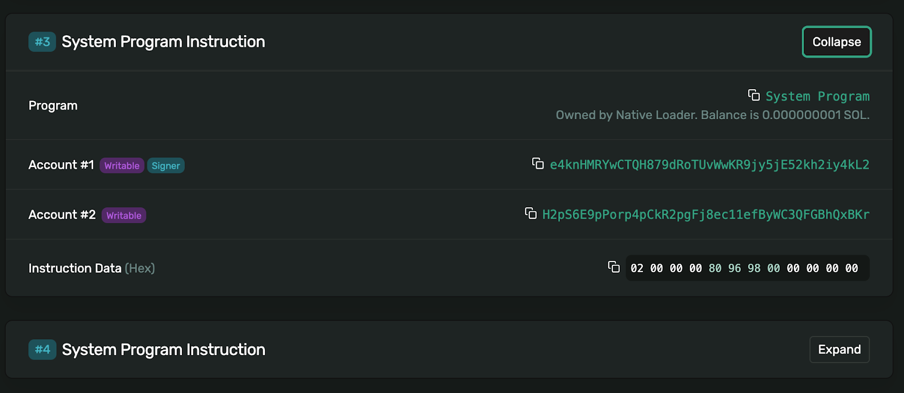
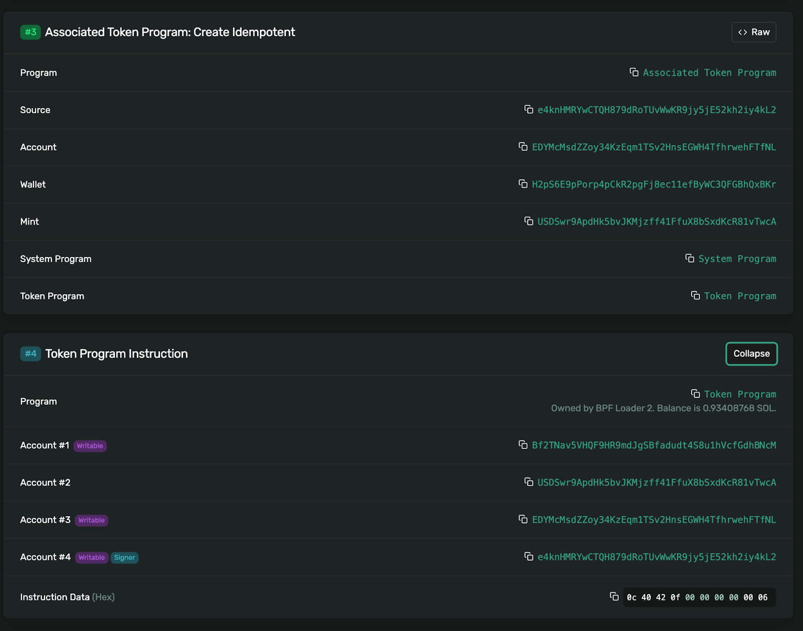
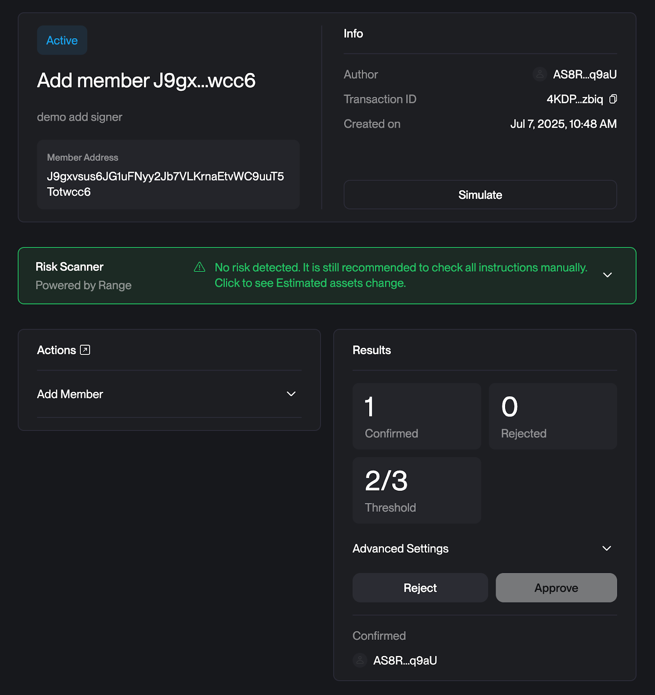
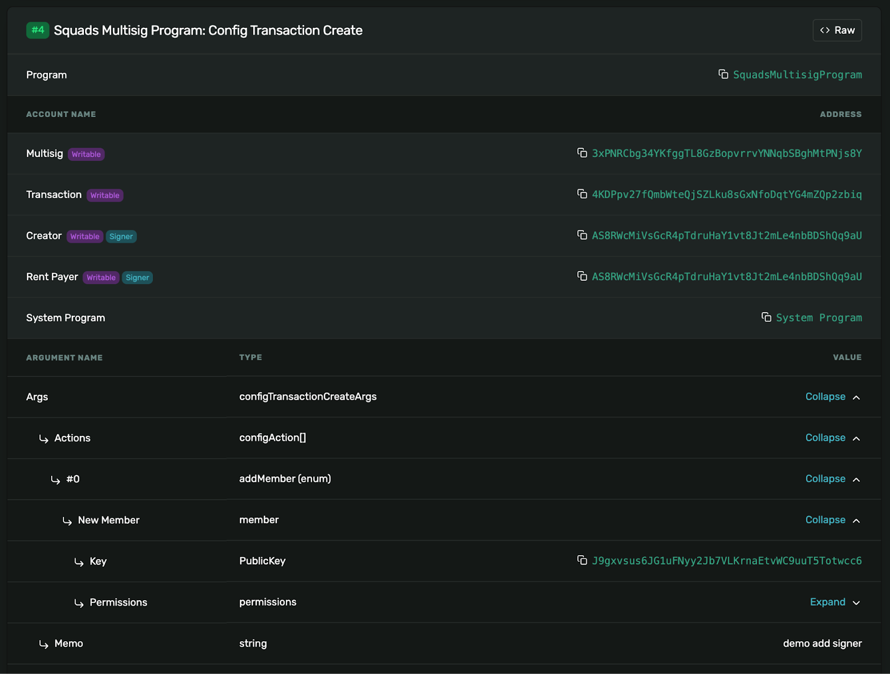
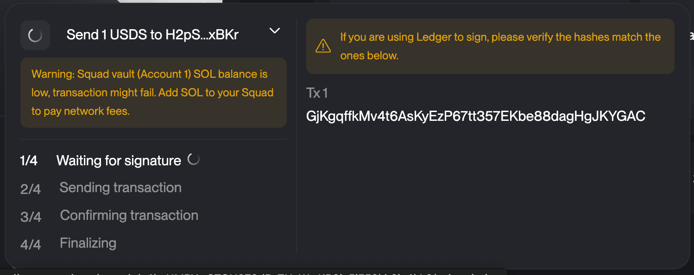

---
tags:
  - Engineer/Developer
  - Security Specialist
  - Multisig Security
contributors:
  - role: wrote
    users: [isaac, geoffrey, louis, pablo]
  - role: reviewed
    users: [dickson]
---

# Transaction Verification & Signing

Proper transaction verification protects against UI compromise attacks and ensures you're signing exactly what you intend. This guide covers verification procedures for both EVM and Solana networks.

## General Signing Guidelines

### Basic Rules
- **Use hardware wallet** & back up the seed phrase
- **Secure signing environment**: For maximum security, all signing activities should be performed on a dedicated, air-gapped, or hardened device running a secure OS. Using a primary work laptop significantly increases the risk of malware interference.
- **Verify the address** according to this guide upon joining any multisig
- **Check transactions** you see in the queue - if unclear what the transaction should do and why, don't sign it and ask for explanation
- **Require "how to check" guide** for every transaction
- **Verify addresses & sums** through third party sources (message from fellow multisig co-signer is not sufficient)
- **Communicate transaction status**: Tell other signers whether the transaction can be executed right away or not
- **Confirm after signing**: Communicate once you've checked and signed ("checked, signed, X more required")
- **Last signer executes**: If the transaction can be executed right away, the last signer does it. If they can't execute, communicate with other signers
- **Re-verify before execution**: If executing an already signed transaction, check it as if you were signing it

## EVM Transaction Verification

Hash verification protects against UI compromise attacks where malicious transactions are injected into the signing flow. The verification process ensures that what you see on the UI matches what you're actually signing on your hardware wallet.

### Key Definitions
- **Domain Hash**: EIP712 domain separator, unique to each Safe - Verifying ensures signature cannot be replayed on other networks or Safes
- **Message Hash**: Raw hash of transaction parameters - THIS appears on your hardware wallet
- **SafeTxHash**: Combined hash of domain + message hash

### Recommended Tools

#### Safe Tx Hashes Util (CLI): Most comprehensive verification tool
- ✅ Calldata decoding (except in interactive mode), signature verification, risk warnings
- ✅ Supports all Safe features including nested Safes
- ⚠️ Requires command line familiarity

#### OpenZeppelin Safe Utils (Web UI): User-friendly alternative
- ✅ Simple web interface, calldata verification
- ❌ Limited features
- Does not currently support non-transaction signature verification
- Does not warn for risky transaction types
- ⚠️ May lag behind CLI tool capabilities

#### Other Tools
- **Lido Safe TX Hashes Calculation**: IPFS hosted tool with simple hash calculation
- **Cyfrin Safe Hashes RS**: Rust based alternative to CLI tool

**Tool diversity recommendation**: Signers should not all use identical tools and should cross-verify results between tools.

### Step-by-Step Verification Process

#### 1. Transaction Preparation
- Use delegated proposer (recommended) to prepare transaction
- Transaction must be proposed to appear in Safe API
- Note the Safe address, network, and transaction nonce

#### 2. Simulation Testing
- Run Tenderly simulation from Safe UI
- Verify expected events and asset transfers appear
- If using a timelock contract, simulation will not show actual transaction effects but instead will emit an event showing the staged transaction data

Safe will generate a Tenderly simulation automatically. For additional assurance, you can manually create the Tenderly simulation from scratch as shown in the screenshot below. This is straightforward for simple contract interactions, but might not be feasible for batch transactions that include a delegateCall to the multisend contract.

1. Paste the contract address in the contract field
2. Paste the calldata from the Safe UI or from the hash verification tool
3. Specify the Safe address as the From address



#### 3. Hash & Calldata Verification

**Using CLI tool:**
```bash
./safe_hashes.sh --network [NETWORK] --address [SAFE_ADDRESS] --nonce [NONCE]
```

The CLI tool pulls the queued transaction from the Safe API for verification. If Safe infrastructure is compromised, it's possible the tool will show a hash that matches the UI, but the transaction is still not what you intend to sign. However, if you also verify the calldata output by the tool, you can be sure you are signing the correct data.

**Interactive mode** (no Safe API dependency):
Use `--interactive` flag to enter all transaction details manually. Note that in interactive mode the tool does not decode the calldata so it's important to verify the calldata in step 5.

**Using web UI:**
1. Navigate to OpenZeppelin Safe Utils
2. Enter Safe address (use checksummed format)
3. Select network and enter nonce
4. Review generated hashes and decoded calldata

**Important**: Both tools require checksummed addresses:
- ✅ Correct: `0xA79C6968E3c75aE4eF388370d1f142720D498fEC`
- ❌ Incorrect: `0xa79c6968e3c75ae4ef388370d1f142720d498fec`

#### 4. Hash Comparison
- **Message Hash** from tools must match hardware wallet display
- **Domain Hash** ensures you're signing for correct Safe
- **SafeTxHash** used for nested Safe approvals

#### 5. Calldata Review
- Decode the calldata using a tool like the SwissKnife Calldata Decoder
- This tool is especially helpful if the transaction contains complex parameters or multicall transactions
- Review decoded transaction parameters
- Verify function calls match intended actions
- Check recipient addresses and amounts
- Look for CLI tool warnings about risky operations

### Special Cases: Nested Safes

Signing a transaction with a nested Safe will result in a different hash appearing on the signing device than what is shown above. This is because the nested Safe transaction is actually calling the `approveHash` function on the parent Safe. 

To verify this hash, use the `--nested-safe-address` and `--nested-safe-nonce` options on the CLI tool to receive both sets of hashes needed for verification.

## Solana Transaction Verification

This guide helps you verify Squads multisig proposals and signatures to ensure:
- Proposal contains expected information (sender, receiver, token, quantity)
- No unauthorized interactions are included
- Signers are signing the expected proposal

**Important**: Limited tooling is available for Solana verification compared to EVM. Exercise extra caution and cross-verify with team members. It would be beneficial to create a Solana fork of the Safe TX Utils CLI for easier verification.

### Anatomy of Squads Transactions

Unlike Safe, in Squads each transaction and proposal is stored on-chain rather than in an off-chain API. This makes it possible to inspect the transaction on explorers like explorer.solana.com or solscan.io. However, the data is harder to interpret and verify.

### Transaction Workflow

#### Step 1: Initial Proposal
Initiate the proposal on the Squads UI. This may include:
- Sending SOL to one or more addresses
- Sending a token (ex. USDS) to one or more addresses  
- Modifying the signers or threshold of the multisig

#### Step 2: Simulation
The Squads UI will provide a simulation link for a transaction once it has been proposed and signed by the first signer. Simulation is helpful for token or SOL transfers, but as of writing this guide it fails for configuration changes. However, there is still a way to inspect the configuration change before execution.

### SOL Transfer Verification


[Transaction Link](https://app.squads.so/squads/e4knHMRYwCTQH879dRoTUvWwKR9jy5jE52kh2iy4kL2/transactions/2sAD1s2cpN8xkDKpsjF3mgpAZ5T6Ly4Zuattr6eMzmjG)
[Simulation Link](https://explorer.solana.com/tx/inspector?signatures=%255B%25221111111111111111111111111111111111111111111111111111111111111111%2522%252C%25221111111111111111111111111111111111111111111111111111111111111111%2522%255D&message=gAIAAgZwPe7Z%252FXshAtomCcciz6nV7UMyPHih06vc7yk9ty6UoAl%252BvEzOMR3HvSFhM2GWdWNVeRQBVmsO%252BMzLyKmaMKEz7jI0LiZeXnyTOKjFEy5Th61mABykSj2asFCSBK3vw7WMKRhm0xquPpdNaEAeFg%252FN30zo7KzBfmzdI3QlkLN55QMGRm%252FlIRcy%252F%252BytunLDm%252Be8jOW7xfcSayxDmzpAAAAAAAAAAAAAAAAAAAAAAAAAAAAAAAAAAAAAAAAAAAAAAAAS9ir2PAxknA4YchoA50xsGOmMh%252FMWqcxS3WgQCJFjjgQEAAUBAAAEAAQABQLAXBUABQIBAgwCAAAAgJaYAAAAAAAFAgEDDAIAAABAS0wAAAAAAAA%253D)

On the simulation page scroll down to **System Program Instruction**

This shows the destination address for the SOL (H2p…Kr) and the Instruction Data. The instruction data can be interpreted as follows.

**Example instruction data interpretation:**
```
02 00 00 00 80 96 98 00 00 00 00 00
```

1. **Split into bytes**: `02 00 00 00 80 96 98 00 00 00 00 00`
2. **First 4 bytes (transfer type)**: `02 00 00 00` = [2, 0, 0, 0] ✅ (confirms this is a token transfer)
3. **Amount bytes (little-endian)**: `80 96 98 00 00 00 00 00` = [128, 150, 152, 0, 0, 0, 0, 0] in decimal
4. **Convert from little-endian to decimal**:
   - Little-endian means least significant byte first
   - `80 96 98 00` = `0x00989680` in big-endian hex
   - `0x00989680` = 10,000,000 in decimal
5. **Convert lamports to SOL**:
   - 1 SOL = 1,000,000,000 lamports
   - 10,000,000 lamports ÷ 1,000,000,000 = 0.01 SOL ✅

**Quick verification method:**
For the amount portion (`80 96 98 00 00 00 00 00`):
- Reverse the order: `00 00 00 00 00 98 96 80`
- Convert hex to decimal: `0x989680` = 10,000,000
- Divide by 1,000,000,000: 10,000,000 ÷ 1,000,000,000 = 0.01 SOL

### USDS Transfer Verification

[Transaction Link](https://app.squads.so/squads/e4knHMRYwCTQH879dRoTUvWwKR9jy5jE52kh2iy4kL2/transactions/CpPSRtvsZjhYrQwXKg72JwnLYsFQEmCkKLLA1v97ggTF)
[Simulation Link](https://explorer.solana.com/tx/inspector?signatures=%255B%25221111111111111111111111111111111111111111111111111111111111111111%2522%252C%25221111111111111111111111111111111111111111111111111111111111111111%2522%255D&message=gAIABQmMKRhm0xquPpdNaEAeFg%252FN30zo7KzBfmzdI3QlkLN55Ql%252BvEzOMR3HvSFhM2GWdWNVeRQBVmsO%252BMzLyKmaMKEzxF5adOSOc03j8RtbcEMRZfSyDhZDpj%252Bf89egzdX3712eUpW3sOB32puEK85AjoAlc8KSleU8LnaIbhD8fK9eRgMGRm%252FlIRcy%252F%252BytunLDm%252Be8jOW7xfcSayxDmzpAAAAAjJclj04kifG7PRApFI4NgwtaE5na%252FxCEBI572Nvp%252BFnuMjQuJl5efJM4qMUTLlOHrWYAHKRKPZqwUJIEre%252FDtQcHMS0dQdpx8PsoDBZizWXr6y4IWcDLrj%252Fb3LJshuCvBt324ddloZPZy%252BFGzut5rBy0he1fWzeROoz1hX7%252FAKkjFIZmLK%252FFij24PsSNF79CaJVsjsMSZHrKijSzMR7OjgQEAAUBAAAEAAQABQLAXBUABQYBAgYHCQgBAQgEAwcCAQoMQEIPAAAAAAAGAbqmLEkSumVVR1a24Yy6rkkWI1IASK6g1AQ30DXoTsREAAEF)

On the simulation page scroll down to **Associated Token Program: Create Idempotent** & **Token Program Instruction**

This shows the destination address for the USDS in section 3 (H2p…Kr) and the Instruction Data. The instruction data can be interpreted as follows.
```
0c 40 42 0f 00 00 00 00 00 00 06
```

1. **Split into bytes**: `0c 40 42 0f 00 00 00 00 00 00 06`
2. **First byte (instruction type)**: `0c` = 12 in decimal ✅ (confirms this is TransferChecked instruction)
3. **Amount bytes (little-endian)**: `40 42 0f 00 00 00 00 00` = [64, 66, 15, 0, 0, 0, 0, 0] in decimal
4. **Convert from little-endian to decimal**:
   - `40 42 0f 00` = `0x000f4240` in big-endian hex
   - `0x000f4240` = 1,000,000 in decimal
5. **Convert raw units to USDS**:
   - USDS has 6 decimals
   - 1,000,000 raw units ÷ 10^6 = 1.0 USDS ✅
6. **Decimals verification**: Last byte `06` = 6 decimals ✅ (correct for USDS)

### Configuration Change Verification


[Transaction Link](https://app.squads.so/squads/e4knHMRYwCTQH879dRoTUvWwKR9jy5jE52kh2iy4kL2/transactions/4KDPpv27fQmbWteQjSZLku8sGxNfoDqtYG4mZQp2zbiq)
Simulation does NOT seem to work for configuration changes, but we have another way we can verify it!

1. Copy the transaction ID ([4KDPpv27fQmbWteQjSZLku8sGxNfoDqtYG4mZQp2zbiq](https://explorer.solana.com/address/4KDPpv27fQmbWteQjSZLku8sGxNfoDqtYG4mZQp2zbiq?signatures=%255B%25221111111111111111111111111111111111111111111111111111111111111111%2522%252C%25221111111111111111111111111111111111111111111111111111111111111111%2522%255D&message=gAIABQmMKRhm0xquPpdNaEAeFg%252FN30zo7KzBfmzdI3QlkLN55Ql%252BvEzOMR3HvSFhM2GWdWNVeRQBVmsO%252BMzLyKmaMKEzxF5adOSOc03j8RtbcEMRZfSyDhZDpj%252Bf89egzdX3712eUpW3sOB32puEK85AjoAlc8KSleU8LnaIbhD8fK9eRgMGRm%252FlIRcy%252F%252BytunLDm%252Be8jOW7xfcSayxDmzpAAAAAjJclj04kifG7PRApFI4NgwtaE5na%252FxCEBI572Nvp%252BFnuMjQuJl5efJM4qMUTLlOHrWYAHKRKPZqwUJIEre%252FDtQcHMS0dQdpx8PsoDBZizWXr6y4IWcDLrj%252Fb3LJshuCvBt324ddloZPZy%252BFGzut5rBy0he1fWzeROoz1hX7%252FAKkVxPfrULPMJ%252BJHEroegjMTe9e7y7fbwd%252BuhToyuOMfEQQEAAUBAAAEAAQABQLAXBUABQYBAgYHCQgBAQgEAwcCAQoMQEIPAAAAAAAGAbqmLEkSumVVR1a24Yy6rkkWI1IASK6g1AQ30DXoTsREAAEF))
   1. This will take you to an 'account' page on the Solana explorer representing just this transaction
2. Click the [first transaction](https://explorer.solana.com/tx/36QYWYC9a5eCtd8QNkdjWmqUyY21wNYBNRtuQrtPqJRg1QbeL8rmVKume21VwrQRjJHZjkHVMMWA1sYWtF4wfZ6u) in the history of this 'transaction account'
3. Scroll down to **Squads Multisig Program: Config Transaction Create**
   1. Expand all fields to view the decoded transaction data



### Step 3: Sign
Sign the transaction but do not execute. When signing the Squads UI will show you the expected hash that will appear on the Ledger.


### Step 4: Execute
Once all signatures are collected, execute the transaction.

## Useful Tools

### Hex to Decimal Conversion
For Solana transaction verification: https://www.rapidtables.com/convert/number/hex-to-decimal.html

### Calldata Decoding
For EVM transaction verification: SwissKnife Calldata Decoder

## Related Documents

- [Hardware Wallet Setup](./hardware-wallet-setup.md) - Device configuration for signing
- [Signing When UI is Down](./signing-when-ui-is-down.md) - Using backup interfaces
- [Emergency Procedures](./emergency-procedures.md) - Emergency signing procedures
- [Backup Infrastructure](./backup-infrastructure.md) - Alternative verification tools
