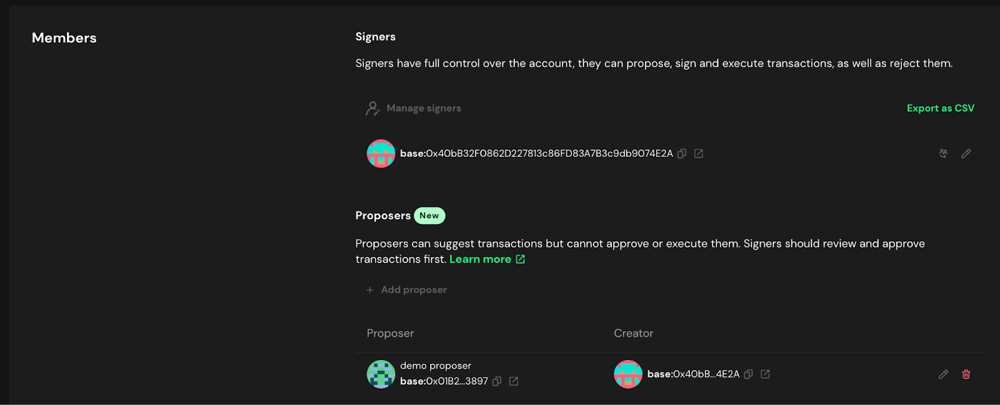

# Setup & Configuration

This guide covers the technical deployment and configuration of multisigs on supported networks.

## Basic Setup

### EVM Networks (Ethereum, Base, etc.)

1. Go to https://app.safe.global
2. Connect wallet of the deploying signer
3. Create new Safe with your determined threshold and signer addresses
4. **Multi-network deployment**: If deploying on multiple networks, Safe UI will offer to replicate the configuration

### Solana

1. Go to https://squads.xyz/squads-multisig
2. Connect wallet of the deploying signer
3. Create new multisig with your determined threshold and signer addresses

## Delegated Proposer

It is recommended, but not required to authorize a separate transaction proposer for a Safe. This address can prepare transactions for signers to sign but is not an authorized signer on the Safe. Therefore **there is no risk of malicious signatures which can affect the Safe assets**. This wallet can hold no funds and simply act as a proposer. The primary reason to have a delegated proposer is that the hash verification utilities depend on the Safe API (unless details are entered manually). Until a transaction is **proposed** it does not show up in the API so the hash verification tools cannot detect it.

## Modules & Guards

### Allowance Module (Required for Treasury Multisigs)

If your multisig will hold any assets on behalf of the DAO, set up governance rescue capability:

**Mainnet configuration:**
- **Module**: Allowance Module
- **Grant allowance to**: DAO Agent 
- **Amount**: Max value for each token held

### Other Modules

Do not install any other modules or guards without explicit governance approval and security review.

## Initial Testing

### Verify Basic Functionality

1. **Small test transaction**: Send a low-value token transfer (e.g., 1 USDS or equivalent)
2. **All signers test**: Ensure each signer can successfully sign the test transaction
3. **Confirm execution**: Verify the transaction executes as expected
4. **Test communication**: Use your established channels to coordinate the test

## Pre-Launch Checklist

- [ ] Safe deployed with correct threshold
- [ ] All signer addresses added and [verified](registration-and-documentation.md#signer-verification-process)
- [ ] Allowance module configured (if required)
- [ ] Test transaction completed successfully
- [ ] All signers confirmed they can sign
- [ ] [Communication channels](communication-setup.md) tested during transaction
- [ ] Safe addresses documented for all networks

Once setup is complete, proceed to Section 3.3 for registration and documentation requirements.

## Nested Safes

A nested Safe is one in which a Safe is set as a signer on another Safe rather than an EOA. This can be useful on a case-by-case basis. For example, if a signer is an entity that might want to have multiple individual signers, the nested Safe could have a 1/X threshold allowing anyone authorized on the team to sign. However, this configuration allows the signers on the nested Safe to update the signer addresses without needing authorization from the main Safe.

It is generally recommended **not** to use nested safe on protocol multisigs unless there is a specific use case that it enables.

## Next Steps

After completing setup:
1. [Registration & Documentation](registration-and-documentation.md) - Document your multisig
2. [Communication Setup](communication-setup.md) - Establish secure communication
3. [Hardware Wallet Setup](hardware-wallet-setup.md) - Ensure all signers are properly configured
