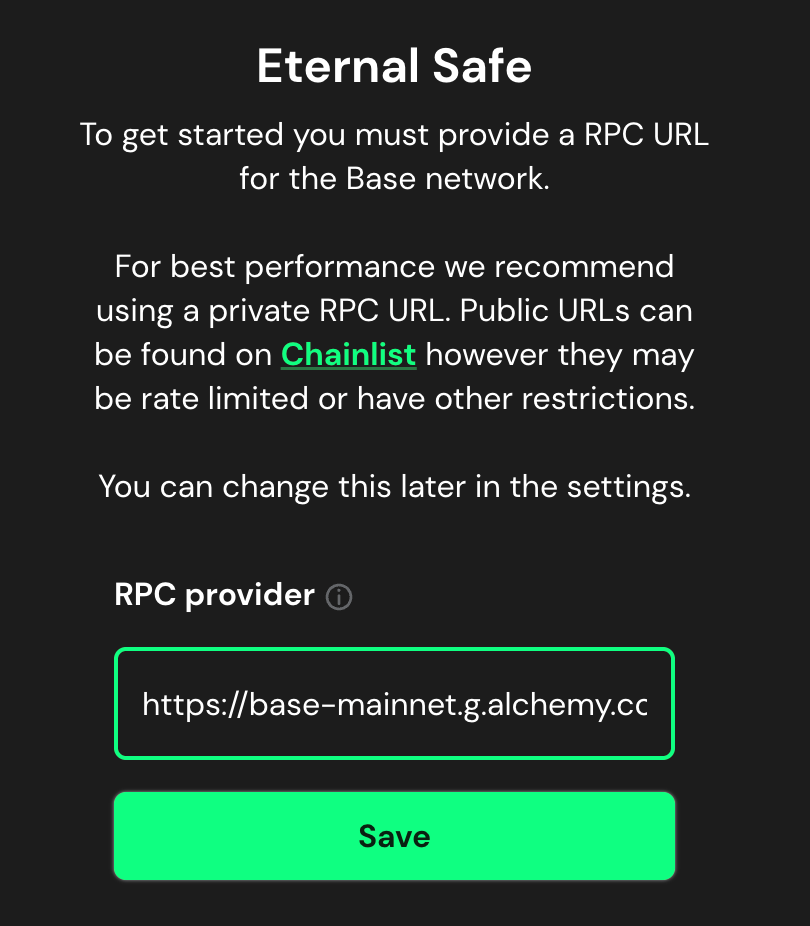
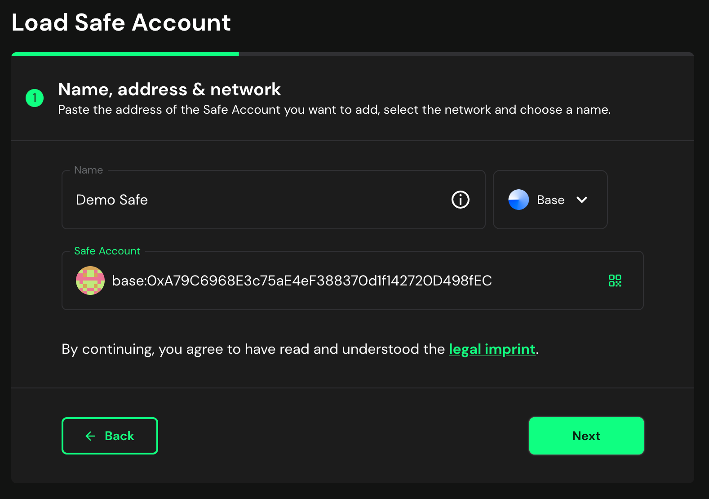
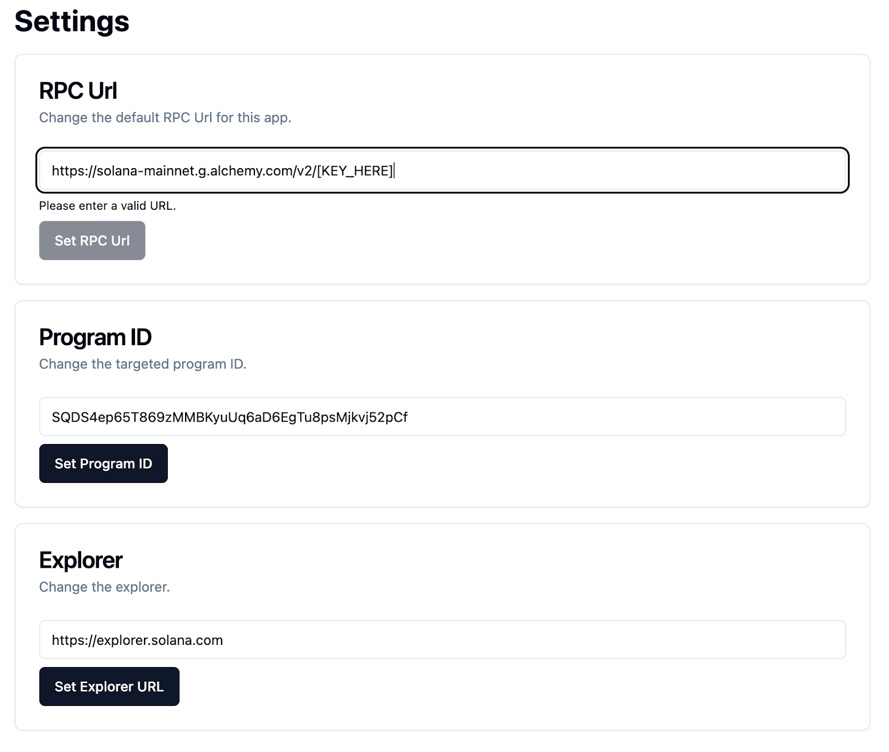
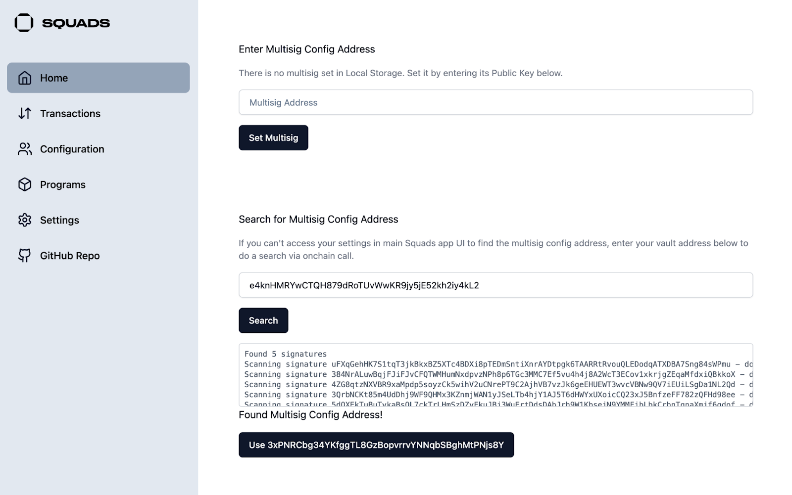
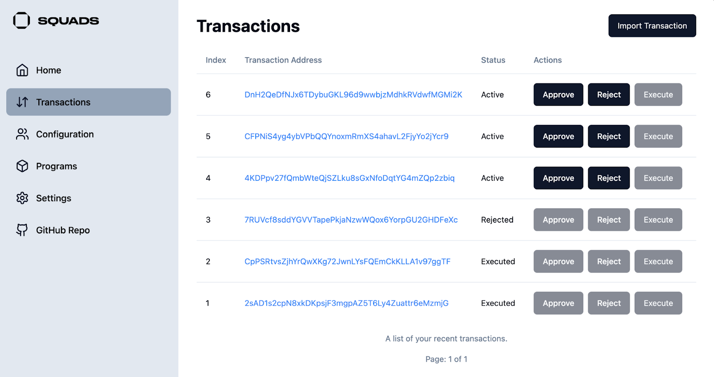

# Signing When UI is Down

If the default interfaces for either Safe or Squads are down or suspected of being compromised, these alternatives enable continued critical signing operations. As a signer, you should familiarize yourself with these tools and practice signing transactions with your team.

## Preparation

**It is recommended to download dependencies ahead of time and store them in a secure location** so they are easily accessible during emergencies.

## EVM Networks

### Eternal Safe - Decentralized fork of Safe{Wallet}

#### Access Options
- **GitHub**: https://github.com/eternalsafe/wallet
- **Hosted (IPFS)**: https://eternalsafe.eth.limo (requires bring your own RPC)
- **Local**: Can be downloaded and run locally

#### Setup

1. Select network and enter an RPC URL
   
2. Enter Safe address and load
   
3. Eternal Safe will automatically detect Ether balances but not ERC20 tokens. They can be added manually
   

#### Transaction Verification

**Critical**: It is still essential to verify hashes and calldata from Eternal Safe. Follow the verification steps in [Transaction Verification & Signing](transaction-verification-and-signing.md).

#### Smart Link System

Once a transaction has been signed by one signer, a **Smart Link** is created which can be forwarded to the next signer to add their signature. The transactions do not go to any centralized backend.

**Example Smart Link:**
```
Please sign this Eternal Safe transaction for the Safe: base:0xA79C6968E3c75aE4eF388370d1f142720D498fEC. 
Current confirmations: 1 of 2.
https://eternalsafe.eth.limo/transactions/tx/?safe=base:0xA79C6968E3c75aE4eF388370d1f142720D498fEC&tx=eyJzaWduYXR1cmVzIjp7ImRhdGFUeXBlIjoiTWFwIiwidmFsdWUiOltbIjB4NDBiYjMyZjA4NjJkMjI3ODEzYzg2ZmQ4M2E3YjNjOWRiOTA3NGUyYSIseyJzaWduZXIiOiIweDQwYkIzMkYwODYyRDIyNzgxM2M4NkZEODNBN0IzYzlkYjkwNzRFMkEiLCJkYXRhIjoiMHgwZDMxZTZjODIxZjBhMGZlM2M5NmNlZWY4ZDNhM2JhZmU3YmZmZTliODQ0ZWNkYzBkYWNmNzc0MzFkODQ0NjU4MTgwZjUwNmZlMjZiZjMzOTQwY2VhOTJiMzlhNDNjODRkMDRhNThiMGY1ODQ2NzhlNzE0YTllMWJkMzE0NTg5ZjFiIn1dXX0sImRhdGEiOnsiZGF0YSI6IjB4IiwiYmFzZUdhcyI6IjAiLCJnYXNQcmljZSI6IjAiLCJzYWZlVHhHYXMiOiIwIiwiZ2FzVG9rZW4iOiIweDAwMDAwMDAwMDAwMDAwMDAwMDAwMDAwMDAwMDAwMDAwMDAwMDAwMDAiLCJub25jZSI6NCwicmVmdW5kUmVjZWl2ZXIiOiIweDAwMDAwMDAwMDAwMDAwMDAwMDAwMDAwMDAwMDAwMDAwMDAwMDAwMDAiLCJ2YWx1ZSI6IjEwMDAwMDAwMDAwMDAwMDAiLCJ0byI6IjB4RTBiY2ZlNWUzMEFCYTBCNDZmMTNCMEMyNENiQzQ3MERDQTNlYjg2NSIsIm9wZXJhdGlvbiI6MH19
```

#### Execution

Once all signatures are collected, execute the transaction. **Note**: Prior to execution you can manually simulate using Tenderly by entering the transaction data, but an automatic simulation link will not be available.

## Solana

### Squads Public Client - Open source Squads V4 interface

#### Access Options
- **GitHub**: https://github.com/Squads-Protocol/public-v4-client
- **Hosted**: https://backup.app.squads.so/
- **Features**: Verifiable build, self-hostable with Docker, IPFS distribution
- **Local**: Can be built and run locally

#### Setup

1. If running locally, follow setup instructions in https://github.com/Squads-Protocol/public-v4-client and access via http://localhost:8080
2. Enter RPC URL in settings
   
3. Enter multisig address in the **lower** text box (Search for Multisig Config) and select the detected Multisig Config
   

#### Transaction Operations

4. Create, approve, or execute transactions. *Smart Links* are not needed for Solana as all transactions are on chain and accessible via the RPC without an API
   

## Security Considerations

### Enhanced Verification

When using backup systems:
- **Extra caution required**: Be more thorough with verification procedures
- **Multiple verification methods**: Use additional tools to cross-check transaction details
- **Team confirmation**: Verify with other signers before proceeding with critical transactions
- **Documentation**: Record use of backup systems and any issues encountered

### Risk Assessment

- **Delay non-critical operations**: Consider postponing non-urgent transactions until primary systems recover
- **Emergency operations only**: For critical emergency responses, proceed with enhanced verification
- **Communication**: Keep team informed about system status and verification procedures

## Testing and Preparation

### Regular Practice
- **Monthly testing**: Practice using backup interfaces during normal operations
- **Team coordination**: Ensure all signers can operate backup systems
- **Process documentation**: Update procedures based on practice sessions

### Emergency Drills
- **Simulated outages**: Practice coordinating with backup systems during drills
- **Communication testing**: Verify backup communication channels work with backup UIs
- **Time measurement**: Track how long backup system activation takes

## Troubleshooting

### Common Issues
- **RPC connectivity**: Switch to alternative RPC providers if connection fails
- **Transaction loading**: Refresh or try different network endpoints
- **Signature verification**: Use multiple verification tools when in doubt

### Support Resources
- **GitHub documentation**: Refer to project documentation for technical issues
- **Team assistance**: Coordinate with other signers for problem-solving
- **Alternative tools**: Have multiple backup options available

## Related Documents

- [Backup Infrastructure](backup-infrastructure.md) - Overview of backup systems
- [Transaction Verification & Signing](transaction-verification-and-signing.md) - Verification procedures
- [Emergency Procedures](emergency-procedures.md) - General emergency response
- [Communication Setup](communication-setup.md) - Backup communication during outages
