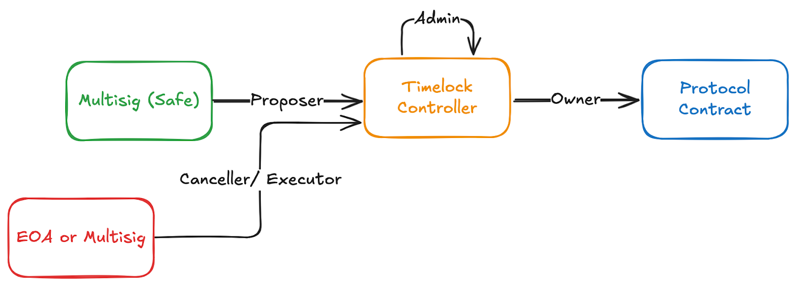

# Timelock Configuration

For sensitive protocol operations like configuration changes or upgrades it is recommended to use a timelock contract (ex. [OpenZeppelin Timelock Controller](https://docs.openzeppelin.com/contracts/5.x/api/governance#TimelockController)) to stage transactions on-chain for final verification before execution. It is not necessary to have a long delay. Some timelock contracts are even configured with 0 delay. The key is to have the full transaction payload fully on chain after signature with a final opportunity to review it and cancel it.

## Configuration

When using a timelock contract the timelock address will be set as the owner or role-holder for the protocol contract.
The Safe will be the sole contract that has the Proposer role on the timelock contract.
The Safe, or an address of a multisig signer, or other desired EOA can be set as the canceller or executor on the timelock contract
By default the timelock contract is set to be its own admin. This means that any changes to timelock contract roles also go through the timelock stage.

## Simulation Consideration

When using a timelock the simulation for the multisig transaction will not show the execution of the transaction but instead the addition of the pending transaction to the timelock. The pending transaction can be simulated manually as shown in [Simulation testing](transaction-verification-and-signing.md#2-simulation-testing).

