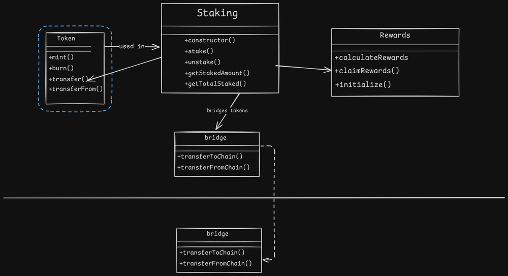

---
tags:
  - Security Specialist
  - Operations & Strategy
  - SRE
contributors:
  - role: wrote
    users: [the-caliber]
---

# Manual Review:
Manual review of a smart contract is the process where a security engineer carefully reads through the source code to identify potential vulnerabilities, logic errors, and design flaws.
The approach to manual review can vary from person to person or team to team. This document outlines some of the possible things the process can comprise.

## Gather resources:  
1. Scope.
2. commit hash.
3. Documentation and specification links.
4. Invariant list, if present already.

## Smart contract higher overview:  
1. **Documentation and whitepaper walkthrough**.
2. **Simplified math formulas:** Get simplified math formulas if the protocol has any any custom/fancy formulas implemented.
3. Get a **high level idea** behind the project: Through diagrams, developer walkthrough.
4. Get a **structural overview** of the project: Check how integration of contracts and functions is happening throughout the protocol.
5. **Create a diagram:** Based on the structual and functional understanding the high level diagram can be created if required.  
	- The digram can be modified over a time as you get more understanding.  
    - The diagram can grow more complex and detailed depending on the time.  
	- There are many tools that can be used like Excalidraw, Miro, Lucidchart etc.  
	- High level structural example of staking diagram:  
	      
		 
## Manual review:
1. **Understand the flow** from [unit tests](unit-testing.md):  
	Test cases are important. It gives you understanding of how the setup is, what state needs to be in place for the users to start using entry point of the system. also it gives you time to test more offensive scenarios (after verifying unit tests) instead of using most of the time in testing general scenarios.
	- When math formulas are involved or complex interconnected calls are involved, debugging the values of variables helps sometime to see how the state changes are happening e.g what is the value of variable x/totalStakedEth before the specific internal/external call. or what it becomes after that call.  
	- Debugging can be done in many ways. depending on which framework you are using. Some examples are.  
	    - Foundry - native debugger, console logs in the contracts, Tenderly debugger, simbolik.  
	    - Hardhat - console logs in the contracts, debuggers like Hardhat-tracer, Tenderly debugger.  
2. **Choose least dependent contract to review one by one:**
		This can be done by looking into a diagram and current understanding of the smart contract functionality. For example in this case it's a Token contracts that is least dependent ( in fact the functionality from that contract is getting used in other contracts so other smart contracts are dependent on it).
3. **Checklist reviews:**
    - Known smart contracts vulnerabilities.
    - Smart Contract Weakness Classification (SWC)
    - Project specific checklists (e.g When dealing with bridges it's also important to check bridge specific checklists).
4. **Maintain list of invariants** for every functions (Can be useful later for other tests/fuzzing/F.V).
5. **Offensively analyse the code** to check logical issues and also out of the box issues.
6. **Visit all paths:**
    Visiting all paths in a smart contract is crucial from a security perspective. For example, in the below withdraw() function, every path has its own potential security implications and behavior that needs to be verified. Sometimes these unexpected paths lead us to potential bugs.

    >While this section focuses more on manual approach, automated testing approaches like fuzzing and F.V can be useful here for checking possible invariant violations across multiple paths.

    As can be seen below everything boil downs to each path. even the ternary expression is a path eventually.  


    ```
    // It may lack a general meaning, but it aims to demonstrate the code with multiple execution paths.
    function withdraw(uint256 amount, bool emergency) public {
            require(amount > 0, "Withdraw amount must be greater than 0");
            uint256 balance = balances[msg.sender];
            bool success;

            if (emergency) {
                success = (address(this).balance >= amount) ? payable(msg.sender).send(amount) : false;
            } else {
                if (balance >= amount) {
                    balances[msg.sender] -= amount;
                    totalBalance -= amount;
                    success = payable(msg.sender).send(amount);
                } else {
                    success = false;
                }
            }

            if (!success) {
                // call other contract to handle failed withdrawal
            }
            emit Withdrawn(msg.sender, amount, success);
    }
    ```  

    In next example, because every value (`_amount`, `minRequired`) can go above and below, the results can vary. If the result is used for some operations like decreasing the `drivingScore` in `burnFuelAndReduce()` for example.

    E.g depending on the amounts are same (as they were while filling the fuel) or increased or decreased, the value of `fuelReduction` will change and while subtracting it from the `drivingScore[msg.sender]` it needs to be handled accordingly. which also creates different paths.

    ```
    function fillFuelAndCalculate(uint256 _amount) public {
            require(_amount > minRequired, "ERR");
            fuelTank[msg.sender] += _amount;
            drivingScore[msg.sender] += (_amount * multiplier) / minRequired;
    }

    function burnFuelAndReduce(uint256 _amount) public {
            fuelTank[msg.sender] -= _amount;
            uint256 fuelReduction = (_amount * multiplier) / minRequired;
            drivingScore[msg.sender] = drivingScore[msg.sender] > fuelReduction ? drivingScore[msg.sender] - fuelReduction : 0;
    }
    ```
7. **Write down notes, doubts and edge cases:**  
One reason for writing down doubts, ideas, possible issues is, when you start going through these issues as you encounter new path you can see more doubts, possible issues in your mind. so sometimes it becomes a loop where you will keep thinking about new ideas while exploring previous/current one.  
    - Take notes for understanding or for further checking.  
    - Doubts: Research on it, Ask applicable doubts to developers.  
    - Edge cases: for later testing. E.g: [test] Possible reentrancy in unstake() function.  
    - Try to break business logic while going through every code block. ( again note down the thing that needs to be tested)  
    - Write down things to revisit after the code is fixed. E.g: In the review you noticed that if specific functionality would be added based on doubts asked or based on the suggested fixes etc, there are chances of something to go wrong for example. Note it down and check in the Fixed code review.  
    - The minimal markdown file for taking notes might look like this:  

    ```
    # Project Name
    ## Scope:  
    GH link:  
    Commit hash:  

    ## Flow:
    1. Manual review
    2. Functional testing:
        - Unit testing
        - Edge case testing
    3. Automated testing:
        - ...
    4. ...

    ## Resources:
    1. Specification doc:
    2. Whitepaper:
    3. Any other documentation and links.

    ## ToDo:
    *Things to do/ remaining things.*   
    1. High level things about audit 
    2. Developer project walk-through.
    3. ...

    ## Common/Doubts/Research:
    1. Relearn about specific cross chain service/protocol that's getting used.

    ## ContractName.sol
    *This contains doubts/points/research/potential bugs regarding the ContractName.sol*
    1. Confirmed issue 1.
    2. Confirmed issue 2.
        ### Doubts/Research:
        1. Checking specific formulas.
        2. Checking specific doubt.
        3. Check the subtraction on L453 can be a problem.
        4. [revisit] Revisit something based on the suggestion given.
        * Testcases:  
            1. [test] User should be able to stake.
            2. [test] Multiple users should be able to stake.
            3. [test] ...

    ## ContractName2.sol
    *This contains doubts/points/research/potential bugs regarding the ContractName2.sol*
    ...

    ---
    ## Questions for developers:
    1. Explanation for formulas.
    2. Questions about intended logic.
    3. ...
    ```
## Functional testing:
1. Check any missing test cases that should be covered.
2. Write and test edge cases from notes taken while manually reviewing contracts.

## Automated review:
1. [static analysis](static-analysis.md)
2. [Fuzz Testing](fuzz-testing.md)
3. [formal verification](formal-verification.md)

## Report writing
1. Discussing doubts and found issues with audit team to come on conclusion.
2. Discussing and conveying issues to developers.
3. Report writing: 
    While structure of the issue/bug to write in the report can vary, These are some of the things that are helpful to include:
    - Issues can contains detailed description, recommendation, severity, status, fixed in commit, acknowledgment from developers.
    - References to correct functions and line numbers while writing issues.
    - Example and POC, helpful for critical bugs.
    - Checking the grammar/style for better readability.

## Fixed code review
1. **Code comparison** helps in identifying updates and detecting any deviations from expected changes.
2. **Reviewing updated code** to check unexpected changes.
3. **Running all the tests** on updated code.
4. **Write new tests for the updated code** if required.
5. **Go through checklists again** for updated functionality (depending on what is updated).
6. **Check things/notes that needs to be revisited** from Manual review:
    Sometimes you can have some things noted E.g: adding this fix to the code can create this problem.
8. **Update the report**, issue's status based on the updated code.
    - Change status.
    - Add 'fixed in' commit link/hash.
    - Add comments from audit team (when required).
    - Add comments from the project team (when required).

## Final thoughts:
Having multiple teams/members review each contract individually leads to better results, as it ensures more sets of eyes are examining the code.

## References
[Auditing mental model by Caliber](https://www.calibersec.com/smart-contract-auditing-mental-model/)
