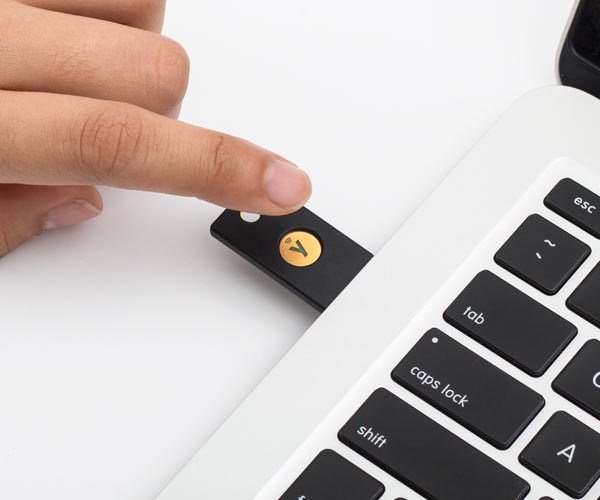
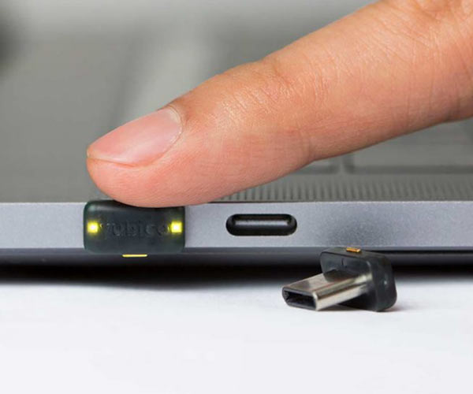
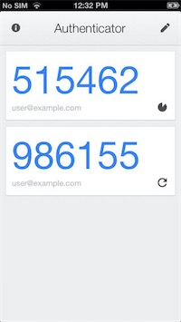
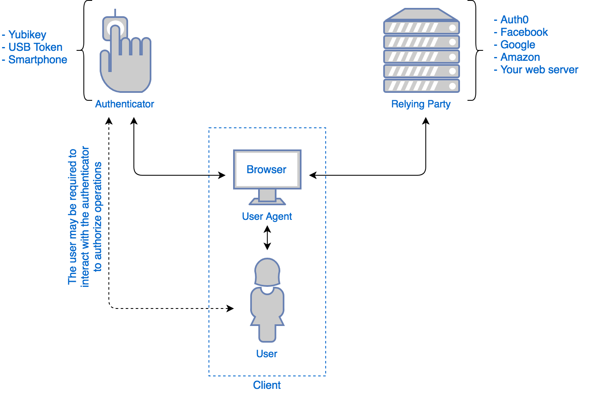

# Use Yubikeys

<aside>
💡 Only buy yubikeys from the official store at [https://www.yubico.com/](https://www.yubico.com/) DO NOT PURCHASE ANYWHERE ELSE.

</aside>

# TL;DR

OTP is when you put in the number from the application in your phone when you login. Baddies will trick you into giving them that during phishing and its been a common part of phishing kits for many years. Using a hardware token where you touch the token in your computer (see images below) rather than use the code currently is the best protection we have — Use it!

# Example Phishing

Phishing with OTP (successful 😢)

[GitHub_Phishing_OTP.mov](GitHub_Phishing_OTP.mov)

Phishing with Yubikey (Safe! 💪🔒)

[GitHub_Phishing_Yubikey.mov](GitHub_Phishing_Yubikey.mov)

## Overview

Most online accounts are secured by a username and a password, this is a single factor of authentication (to prove you are who you say you are!), to keep everyone safe the general security guidance is to recommend that users have an **additional** form of authentication. This means that if a **baddie** has your username and password they also need something else to login to your accounts!

Some examples of Multi-factor options:

- **Software Authenticators** - Google Authenticator / Authy
- **Hardware Tokens** - Yubikey, Google Titan security key
- **Mixed** - Touch ID on Mac
- **Application Specific pushes** - Duo Security, Okta, Google Mail

## Types of MFA

Modern MFA is most commonly split into two different types, one being OTP/TOTP and the Fido2/WebAuthN

**OTP/TOTP**

OTP/TOTP stands for **O**ne **T**ime **P**assword or **T**ime-based **O**ne **T**ime **P**assword. Commonly you will just see them as the numbers in authenticator apps like Google Authenticator or Authy:

Untitled

These numbers are generated from a **seed** value when you first setup the application (commonly sent via a QR code). They then periodically update based on an interval of time having passed or the current time.

## FIDO2/WebAuthN

WebAuthN is the most modern means of authentication we have and prevents phishing (for now!) The way it works is when you need to login to a website you put in your username and password and the website itself will communicate with the browser and ask for you to authenticate. This is similar to the way the browser integrates with something like a crypto wallet!

(taken from [https://auth0.com/blog/introduction-to-web-authentication/](https://auth0.com/blog/introduction-to-web-authentication/))

**Note:** Fido2 is technically a protocol that lets you communicate to different authenticators and WebAuthN is the way we use that authentication to communicate to authorization services.

## Additional resources

Multi-part entry on the history of attacking MFA:

[https://www.linkedin.com/pulse/conceit-weak-authentication-part-1-jeff-nathan/](https://www.linkedin.com/pulse/conceit-weak-authentication-part-1-jeff-nathan/)[https://www.linkedin.com/pulse/conceit-weak-authentication-part-2-jeff-nathan/](https://www.linkedin.com/pulse/conceit-weak-authentication-part-2-jeff-nathan/)[https://www.linkedin.com/pulse/conceit-weak-authentication-part-3-jeff-nathan/](https://www.linkedin.com/pulse/conceit-weak-authentication-part-3-jeff-nathan/)
